# 开始


让我们通过使用 LighterBase 来创建一个简易项目来学习如何使用它的Web版本。

## Step 1

LighterBase 致力于通过更简易更轻便的方式来帮助你进行后端的搭建

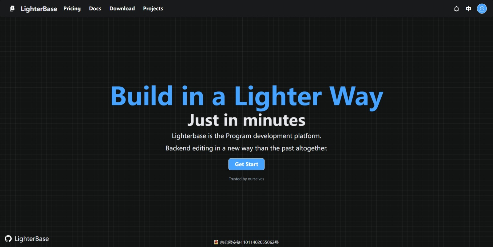

在主页界面，我们需要创建一个用户，点击右上角或 get started 来开始

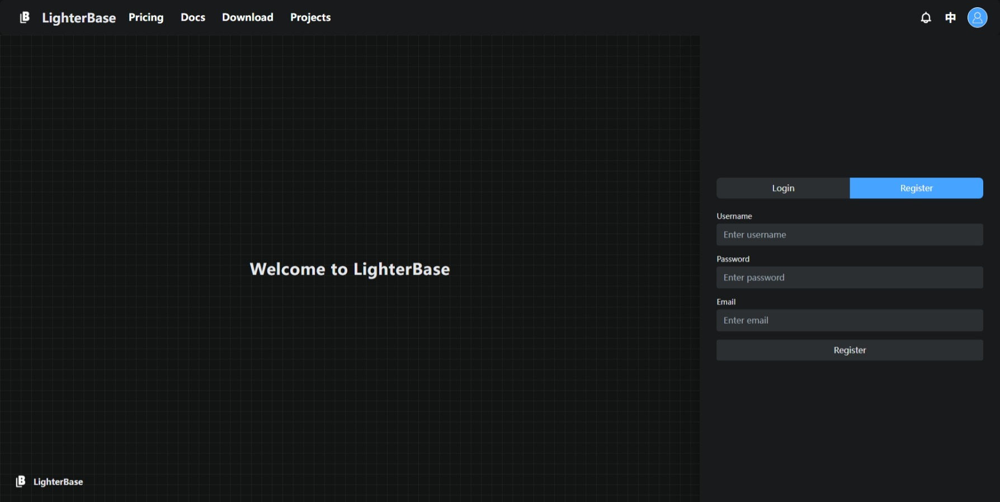

我们需要你提供你的邮箱地址，这并不意味着我们会通过邮箱向你发送任何性质的广告邮件，正相反，你需要主动联系我们向我们需求帮助后我们才会按照你的地址向你回信

同时邮箱地址也是你除去用户id外唯一的辨识标志，这意味着一个邮箱仅能创建一个账户

现在进行登录

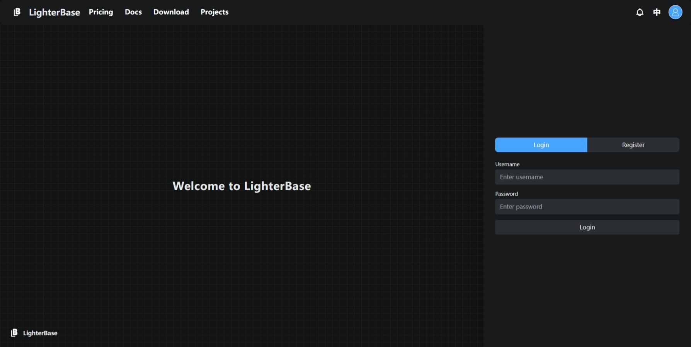

## Step 2

让我们进入项目管理页面，你可以在这里预览并管理你的所有项目，包括删除，分享，SQLite数据库下载，不过现在，我们先创建一个新的项目

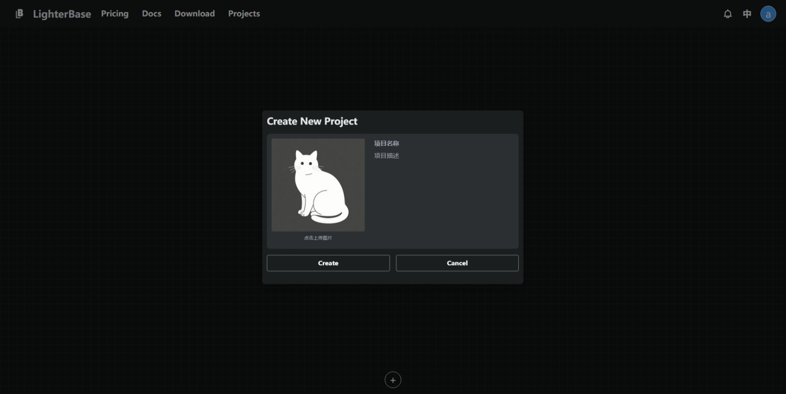

在这个页面，你需要设置项目的图标（你也可以使用我们的默认图标），项目的名称和简介，它们也可以在创建后被随时修改

我们先创建一个示例项目，项目的名称为arcData，项目描述可以为空值（不过没道理不写一点对吧）

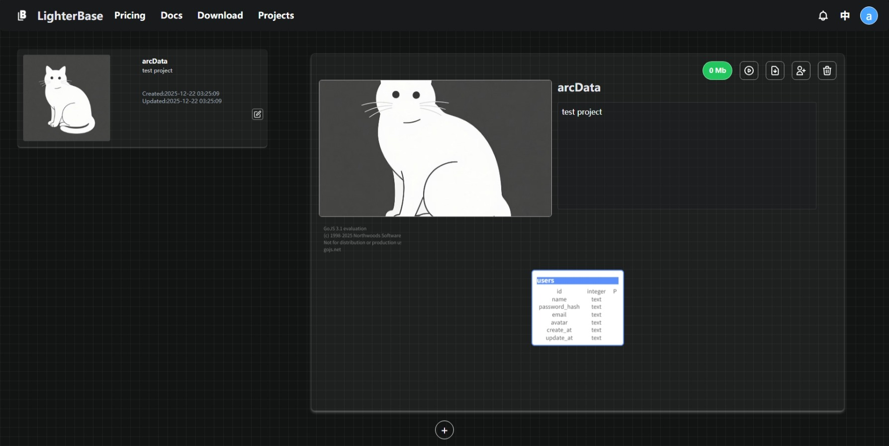

然后打开项目，我们需要你为项目设置一个管理员账号，这是为了项目的安全性和本地化考虑，这个账号的密钥可以在项目设置里随时进行修改

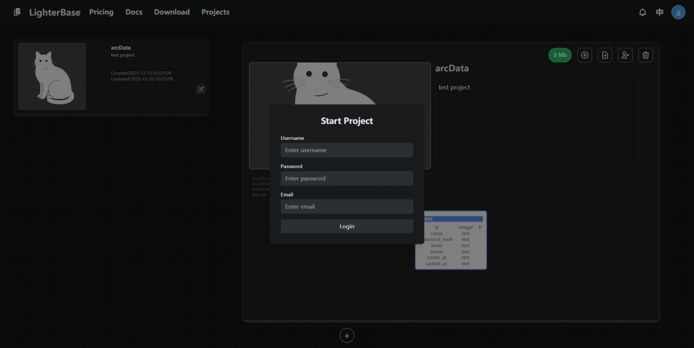

## Step 3

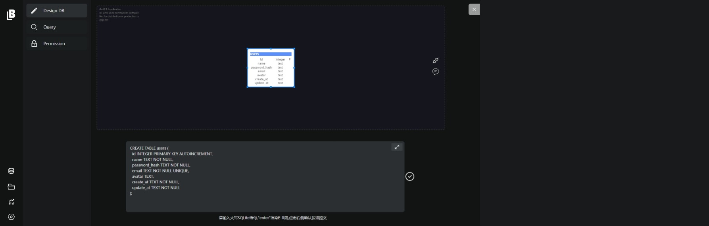

进入项目后，我们需要你书写SQL，LighterBase 致力于通过简单的SQLite代码来构建你的后端设计 ，我们已为你提供完整的users表单，如果你需要修改它，请使用

```sqlite
ALTER TABLE users ADD COLLUMN
```

来进行修改

我们不建议你对现有表属性进行修改，仅建议增加新的列元素

现在让我们创建两个新的表

```sqlite
-- 1. 创建 characters 表
CREATE TABLE IF NOT EXISTS characters (
    id       INTEGER PRIMARY KEY AUTOINCREMENT,
    userid   INTEGER NOT NULL,
    name     TEXT    NOT NULL,
    atk      INTEGER NOT NULL CHECK (atk >= 0),
    hp       INTEGER NOT NULL CHECK (hp >= 0),
    FOREIGN KEY (userid) REFERENCES users(id) ON UPDATE CASCADE ON DELETE CASCADE
);

-- 2. 创建 monsters 表
CREATE TABLE IF NOT EXISTS monsters (
    id       INTEGER PRIMARY KEY AUTOINCREMENT,
    userid   INTEGER NOT NULL,
    name     TEXT    NOT NULL,
    atk      INTEGER NOT NULL CHECK (atk >= 0),
    hp       INTEGER NOT NULL CHECK (hp >= 0),
    FOREIGN KEY (userid) REFERENCES users(id) ON UPDATE CASCADE ON DELETE CASCADE
);
```

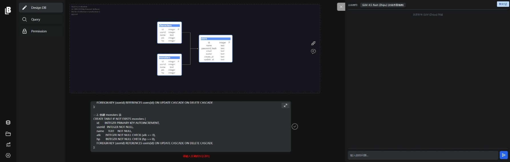

可以看到ER图自动刷新反映了这个简单的数据库结构，

现在点击提交按钮，如果你在SQLite书写中遇到了困难，你可以通过对话按钮向大模型寻求帮助（我们默认接入了GLM-4.5flash，你也可以在设置中接入自己的api来调用你的大模型）

!!!

注意如果你需要修改提交后的表结构，你依然需要使用`ALTER TABLE 表名`来再次提交进行修改，你需要完全考虑你的数据库设计后再做出提交

!!!

然后让我们来到查询（Query）部分，在这里你可以使用一些不会影响表结构的SQLite语句如`SELECT INSERT DELETE`来帮助自己理解你的数据库设计、添加或删除初始数据

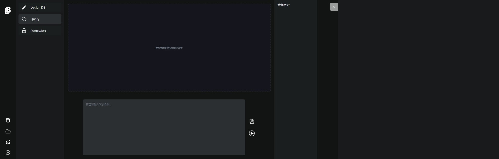

你可以保存你的查询以便于在下一次来使用它

## Step4

​	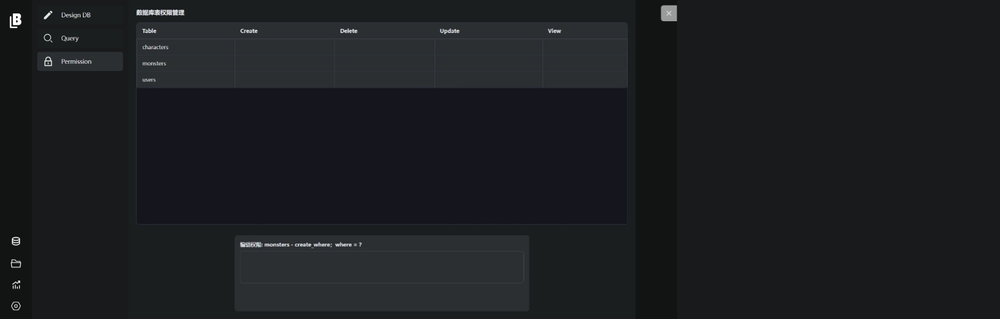

现在我们需要对表进行权限设置，你需要明确可供用户CRUD操作的权限明细，你可以通过`where`来对权限进行设置

| 内容                        | 含义                                                         |
| --------------------------- | ------------------------------------------------------------ |
| @uid                        | 仅已登录用户可使用此权限（你的项目的用户而非LighterBase用户） |
|                             | 空值表示全部放行                                             |
| 1=0                         | 表示全部用户都不放行                                         |
| @uid =1                     | 仅管理员用户（第一位注册登录的用户即你自己）放行             |
| 条件判断（值为true或false） | 真值即放行，假值即不放行                                     |

我们的测试项目可以全为空值，允许任何人修改、

## Step5

现在让我们回到Design DB板块，通过API按钮来查看文档的SDK内容

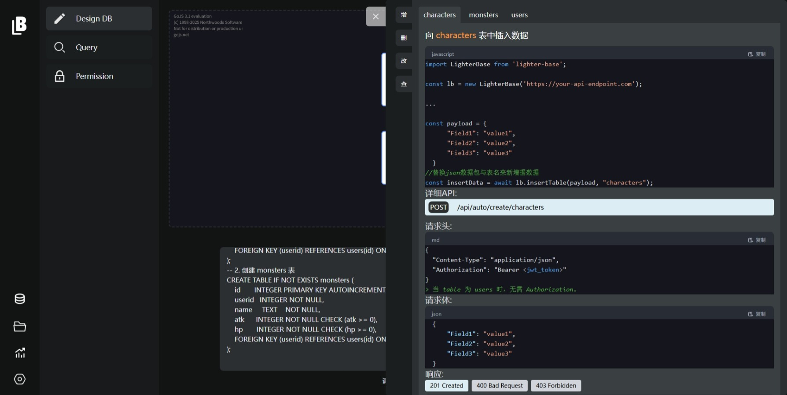


如最简化，你仅仅需要一个前端html文件和js文件，这需要你提前准备，现在让我们假设你的前端已经写好，且有一个js与之关联，我们首先需要引入LighterBase库


```js
import LighterBase from 'lighter-base';
```

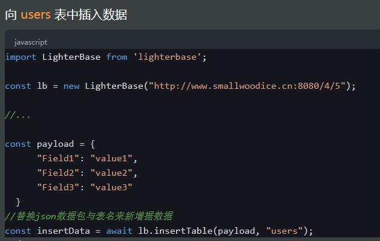

在这里可以看到增的示例，你可能已经注意到URL的构成，我们自动显示给你了id与项目id，同时，如果你是本地APP用户，这里的URL应该是localhost:8080:或者127.0.0.1:8080

让我们将增删改查的所有内容都放入其中

```js
//XXX.js
const lb = new LighterBase("http://www.smallwoodice.cn:8080/...");

//...

const payload = {
      "Field1": "value1",
      "Field2": "value2",
      "Field3": "value3"
  }


const lb = new LighterBase("http://www.smallwoodice.cn:8080/...");

//...

const payload = {
      "WHERE": "id = ..."
  }
// 删除满足条件的记录（禁止删除 users 表 id=1 的记录）
const deleteData = await lb.deleteTable(payload, "users");
......
```

可以看到，上面的Field1等内容需要你填写你的表内容，在这个项目中我们需要改为

```js
const payload = {
      "id": "1",
      "userid": "2",
      "name": "Mon3ter",
      "atk": "3300",
      "hp": "3000"
  }
```

这样我们就相当于人为新增了一个character Mon3ter，如果你需要在前端进行增删改查操作，请设置为变量，其他的操作也类似上述示例。
